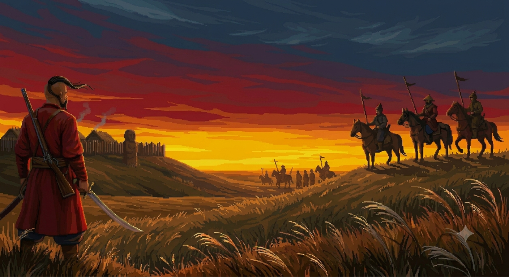

# Sloboda



**Sloboda** is a Warcraft II-style real-time strategy game about colonizing
the "Wild Field" (Дике Поле) — the Sloboda frontier of 17th-century Ukraine.
Build a hutir, gather gold, timber, salt and food, raise a Cossack army, and
hold the steppe against Tatar raiders.

It started as an experiment: how far can you get building a classic RTS
engine (pathfinding, fog of war, economy, base building, AI, a scripted
campaign system) largely with AI assistance, then re-skin it with an
original setting and art direction instead of generic fantasy.

All game art (units, buildings, portraits, terrain objects) is either
procedurally drawn in code or AI-generated pixel art specific to this
setting — no third-party asset packs.

## Quick start

Requires Node.js.

```bash
npm install
npm run dev
```

Open **http://localhost:5173** — the menu loads straight away, pick a
faction and click to start a 1v1 skirmish against the AI.

Other useful commands:

```bash
npx tsc --noEmit   # typecheck
npm run build      # typecheck + production build (outputs to docs/, served via GitHub Pages)
```

## Setting

Two sides, sharing the engine's original `alliance`/`horde` internals under
new skins:

- **Слобожани (Sloboda settlers)** — steel, watchtowers, discipline. Cossacks
  and settlers colonizing the frontier.
- **Татари (Tatars)** — blood, bonfires, momentum. Raiders out of the
  steppe, no fixed base — they strike from off-map posts and camps.

Units and buildings are reskinned on top of the underlying engine roles:

| Role | Label | Notes |
|---|---|---|
| Worker | Селянин (Peasant) | Has a dedicated work animation (axe) |
| Footman | Козак (Cossack) | Otaman-style saber art |
| Archer | Стрілець (Musketeer) | Musket-armed cossack |
| Knight | Сердюк | Kharakternyk art for now; becomes a full hero unit later |
| Catapult | Гармата (Cannon) | Placeholder procedural art |
| Townhall / Farm / Barracks / Workshop / Tower | Хутір / Хата / Курінь / Кузня / Дозорна вежа | |

## What's implemented

**Core engine**
- A* pathfinding, fog of war, spatial indexing for large unit counts
- Base building, unit training, formations, basic AI opponent
- Caravan system (scripted convoys that can be escorted or ambushed)
- `StoryController` — a DSL for scripted campaigns: phases, objectives,
  triggers, dialogue, cutscene-style camera/FX events, branching outcomes

**Economy (M2)**
- Four resources: gold, lumber, salt, food — plus population/pop-cap from
  houses and the townhall
- Salt deposits (2×2 nodes) placed on the map
- Wildlife: deer and boar roam near forests and flee when attacked; hunting
  them down drops a carcass (which rots over time) that peasants haul back
  to feed the settlement
- Resource/food cost hooks are wired into the economy system, ready for
  scenarios to turn on upkeep without touching AI (which doesn't hunt yet)

**Story campaign**
- "Перша слобода" ("The First Sloboda") — an in-progress 4-act scenario
  (road / hillfort / neighbors / captives) built with the level editor and
  `StoryController`, featuring a hero unit (Otaman), scripted raids, a
  neutral caravan, and multiple resolvable objectives
- A built-in engine demo scenario ships alongside it as a reference/testbed

**Level editor**
- Available at `?editor` (e.g. `localhost:5173/sloboda-rts/?editor`)
- Terrain/placement/selection/erase/area tools, brush sizes, minimap,
  WASD + pan + zoom navigation
- Palettes for terrain, resources, buildings, units, animals, landmarks
- A campaign panel for authoring phases, triggers, dialogue and starting
  economy without hand-writing coordinates
- Exports a ready-to-use `StoryMapDefinition` plus raw JSON for re-import

**Debug tools**
- A debug panel in the main menu for jumping straight into pathfinding
  tests, performance stress tests (100/300/500 units), a fast caravan demo,
  or a skirmish with a fixed seed/race/difficulty

## Controls

- **LMB** — select · **Shift+LMB** — add to selection · **double LMB** — select all on screen
- **RMB** — move / attack / gather
- **Ctrl+1..9** — assign control group · **1..9** — select control group
- **Q** — attack-move · **X** — stop · **H** — jump to townhall · **B** — build menu
- **R** — restart · **M** — mute

## Tech stack

- TypeScript + Vite
- Phaser 3
- No external art dependencies — everything is either code-drawn or shipped
  as generated PNGs under `public/assets`

## Project layout

```
src/
  scenes/     Boot, Menu, Game, UI, Editor scenes
  entities/   Unit, Building, Animal, Caravan, ResourceNode
  systems/    Pathfinding, AI, Economy, Formation, SpatialIndex, FX, Audio
  story/      StoryController DSL + story map definitions (incl. Persha Sloboda)
  editor/     Level editor panels, minimap, data types
scripts/      Python asset pipeline (background removal, sprite sheet building)
public/assets/
  art/        Generated engine-format sprite sheets (units/buildings/fx/terrain/ui)
  sloboda/    Source Sloboda-specific art (objects, units, portraits)
```
